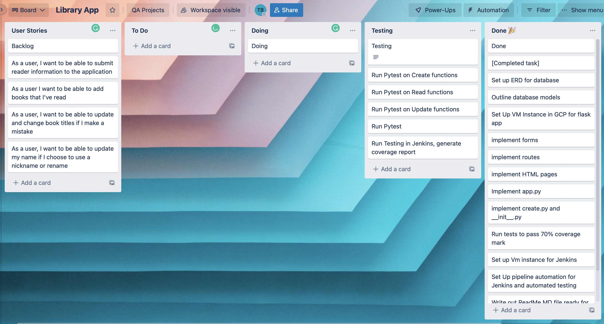
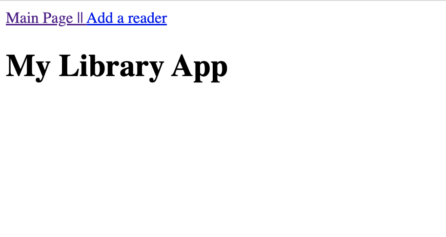
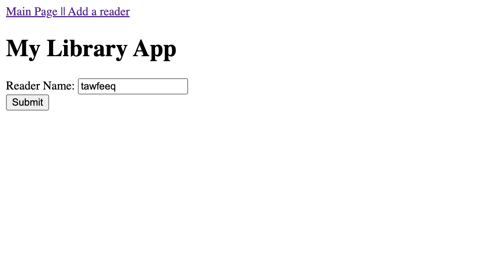
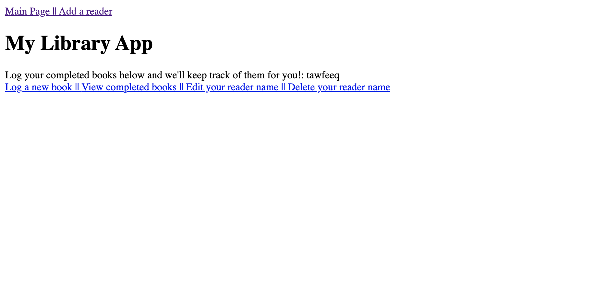
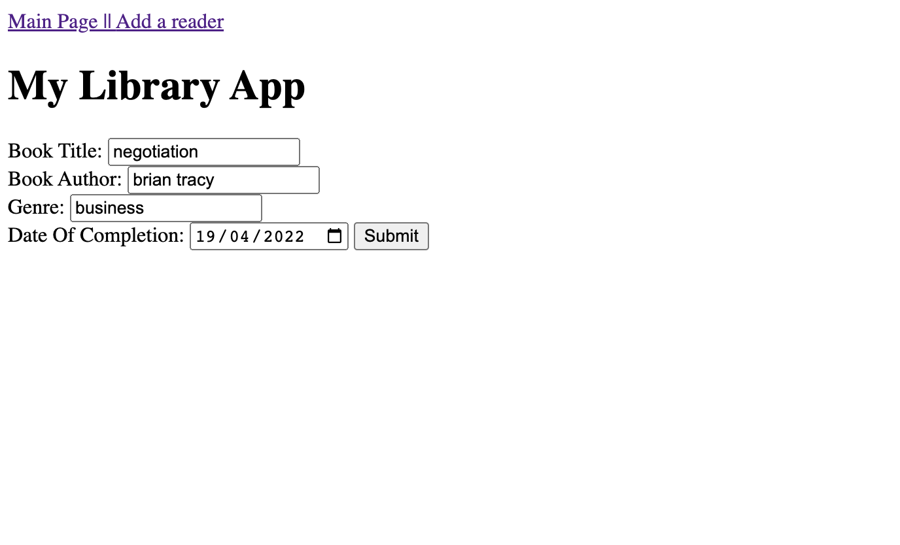
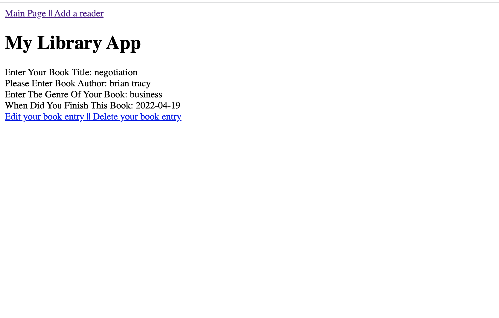
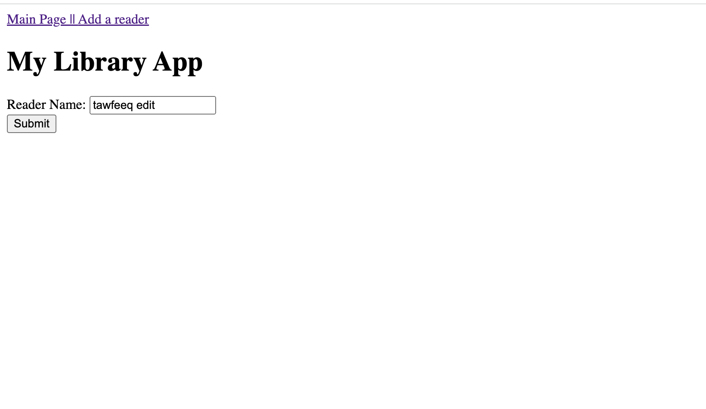
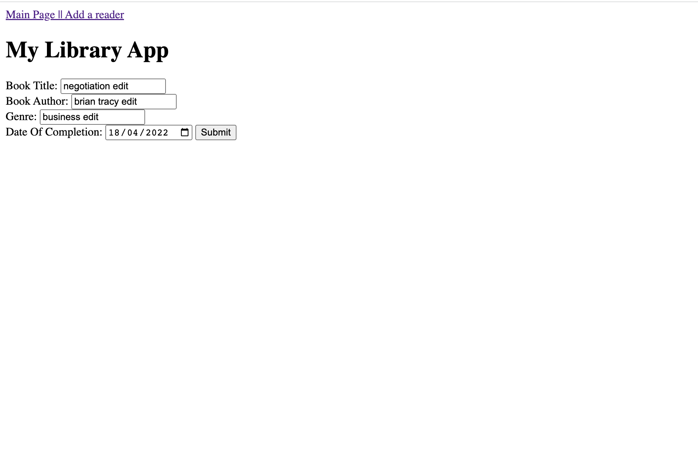
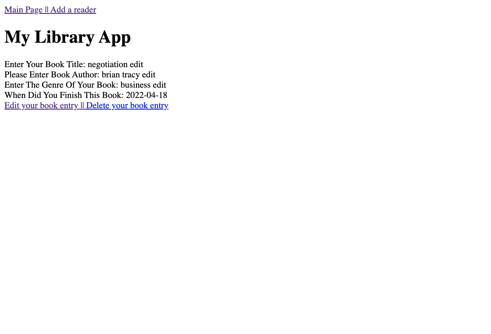

# Library App

* [Brief](#brief)
    * [Additional Requirements](#additional-requirements)
    * [My Approach](#my-approach)
* [Project Structure](#project-structure)
    * [Database Architecture](#database-architecture)
    * [Planning](#planning)
    * [Risk Assessment](#risk-assessment)
    * [CI Pipeline](#ci-pipeline)
* [Unit Testing](#unit-testing)
* [Front-End](#front-end)
* [Future Improvements](#future_improvements)
* [Authors](#authors)

## Brief

Our first fundamental project - DevOps Core 
Fundamental Project Specification - requirements 
were to create an application that displayed Create, Read, 
Update and Delete functionality.
  
This was to demonstrate what we had learnt in our cohort so far.
  
### Additional Requirements
We were also instructed to include the following into our  projects: 
1. Kanban template.
2. Clear documentation of the design phase, app architecture and risk assessment.
3. A python-based functional application that follows best practices and design principles.
4. Test suites for the application, which will include automated tests for validation of the application.
5. A front-end website, created using Flask.
6. Code integrated into a Version Control System which will be built through a CI server and deployed to a cloud-based virtual machine.
  
## My Approach

In order to the project brief and requirements above, I have created an application to enable the user to do the following:
  
### <u>CREATE</u>
Create a reader account that stores the following data:
 Reader Name
 Book Name
 Book Title
 Author Name
 Date of Completion
  
### <u>READ and UPDATE</u>
View and update the following data:
 Reader Name
 Book Name
  
### <u>DELETE</u>
This function is shown by allowing the reader   to delete the following:
  Reader Name
  Books
  

# Project Structure

## Database Architecture
Here is my entity realtionship diagram and represents the  
data that is now in my Forms and Classes.

## Planning

My choice of Kanban template software was Trello. 
I began my project by imagining what a user who wants 
and needs when tracking their completed books.  

My planning has been structured through the following components:
* A trello board
* A risk assessment
* CI-Pipeline

Below is a screeshot of my Kanban board created for the project.  
I first made my user stories as these are the main requirements that need to be implemented 
for my project. I could then use these stories to be able to create "to do" tasks. 

These to do tasks include any implementations that are required to make the app functional for the MVP.

### Risk Assessment:  
I have made a risk assessment as well which is shown below.  
This risk assessment contains the impact of each predicted risk related to my project as well as a contingency and mitigating plan.

### CI Pipeline

Below is the Continuous integration pipeline that I have made and followed through development of my project:  

## Unit Testing
I used Pytest to test my application. This was used throughout all of jenkins and was even used to automate the tests on Jenkins.  
As you can see below, Jenkins has created an index.html file that contains the coverage report: 

The console output has also been shown below, this shows pytest running the tests seccessfully and a successful build as well.

## Front-End:

* Home page user first lands on when using the app. 

* User enters data for reader name(CREATE functionality):   

* App returns reader name(READ functionality):  

* App provides option to assign book data to reader(CREATE functionality):  

* App displays reader book information(READ functionality):  

* App displays edit reader form(UPDATE functionality): 

* App displays updated reader name(UPDATE functionality): 

* App displays edit book form(UPDATE functionality):

* App displayed updated book(UPDATE functionality):

The delete functionality in my applicaion is also 100% functional.  
The teader can be deleted by clicking the delete button next to their name on the home screen.  
Also the book entry can also be deleted by clicking the delete button on the view reader books page. 

## Future Improvements
One future improvement that i would like to implement in my projects is time management.
I feel that i underestimated the time required for each task in relation to my current skill base. 
This resulted in me having to work extra hours trying to catch up rather than improving and reiterating the app.  

Another improvement I feel that i could make for next time is to implement a clear navigation system that includes instructions of use on the homepage.
This would result in a better and smoother user expereince of my app as well as maintaining functionality.

## Authors
Tawfeeq Babou